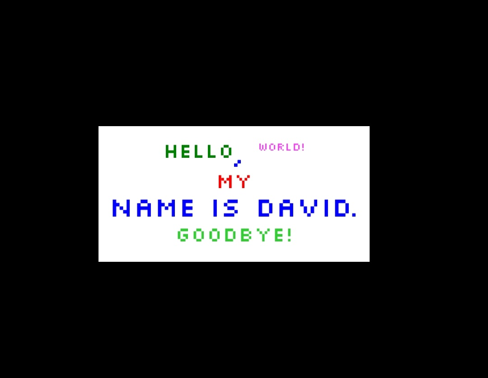

# How to use [StylizedTextParser](https://github.com/Davuskus/MonoGame.Utils/blob/master/MonoGame.Utils/Text/StylizedTextParser.cs)

StylizedTextParser is a utility class for parsing text with a certain syntax which will be explained below. The syntax allows for a lot of customization within the text, e.g. different fonts, colors and opacities.

# Syntax
This is an example of an input text:
```
{Hello[color=Green]}, {World![color=Magenta, font = silkscreen20, opacity=0.75]}
{My [color=Red]} name is David.
{Goodbye! [color=lime green]} [color=Blue,font=silkscreen48]
```
# Parsing
The parser will look for braced areas, find the so called "style blocks" (surrounded by brackets), extract the specified styles and apply them to the other text within the braced area. Text that does not have a style block gets the default style which can be configured. The style blocks affect text to their left. New lines are by default defined with actual new lines (\n) but this can be configured as well.

The output from the parsing methods is a list of different "rows" containing all of the stylized words ready for rendering with MonoGame.

## Fitting to a certain width
There is a method for fitting the text to a certain width, thereby overriding any new lines in the original input text if necessary.


